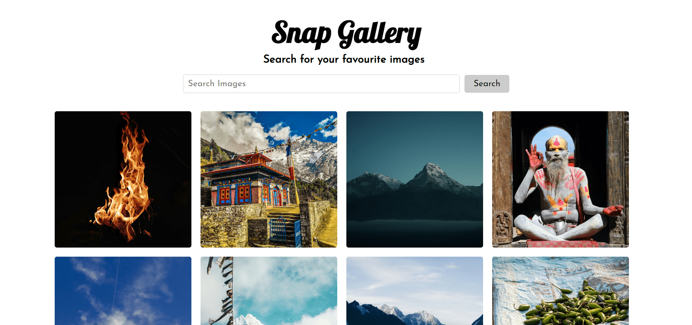

# SNAP GALLERY
[Demo of Snap Gallery](https://snap-gallery-binay7587.vercel.app)


## Summary
SnapGallery is a photo gallery that is built using React Hooks, React Router and Context API. The images in the gallery are obtained through the Unsplash API and retrieved using Axios.

## Motivation

The purpose of this project was to get familiar with React Hooks, React Router and Context API.

## Setup Instructions

First clone this repository.
```bash
$ git clone https://github.com/Binay7587/snap-gallery
```

Install dependencies. Make sure you have [`nodejs`](https://nodejs.org/en/) & [`npm`](https://www.npmjs.com/) installed in your system.
```bash
$ npm install # or yarn
```

Run
```bash
$ npm start # or yarn start
```

<!-- FURTHER ENHANCEMENT -->
## Further Enhancement
Some of the future enhancement for the application are listed below.
1. Bla bla bla
2. Bla bla bla

<!-- BUILT WITH -->
## Built With

* [React.js](https://reactjs.org/)

<!-- CONTRIBUTING -->
## CONTRIBUTING

Everyone is welcomed to contribute to this project. You can contribute either by submitting bugs or suggesting improvements by opening an issue on GitHub. Please see the [CONTRIBUTING](CONTRIBUTING.md) guidelines for more information.

<!-- CONTACT -->
## Contact

Binaya Karki - [@binay7587](https://www.linkedin.com/in/binay7587) - me@binayakarki.com.np

Repository Link: [https://github.com/Binay7587/snap-gallery](https://github.com/Binay7587/snap-gallery)

<p align="right">(<a href="#top">back to top</a>)</p>

<!-- LICENSE -->
## License

Distributed under the MIT License. See [https://github.com/Binay7587/snap-gallery/blob/master/LICENSE](https://github.com/Binay7587/snap-gallery/blob/master/LICENSE) for more information.

<p align="right">(<a href="#top">back to top</a>)</p>